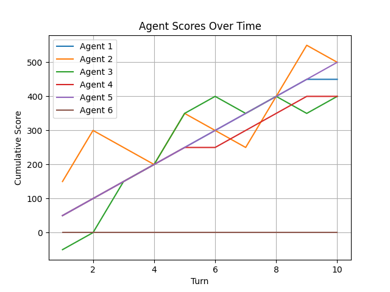

# Strategic Agent Decision Making SADM
A Python-based simulation demonstrating various decision-making strategies in a probabilistic environment.

## Introduction
The project begins by introducing **six agents**, each with its own distinct decision-making strategy, into a game-like scenario where they make choices with varying probabilities of success and failure. The core mechanics are simple: each agent chooses one of three possible moves—**Move A (Safe)**, **Move B (Risky)**, or **Move C (Neutral)**—with associated outcomes. Move A offers a steady, albeit slow, gain with a 90% chance of a +50 score and a 10% chance of no gain. Move B, on the other hand, is riskier, providing a 50% chance of a significant +150 score or a 50% chance of losing -50. Move C results in neither gain nor loss.

## Agent Strategies
The decision-making strategies of the agents are designed to mimic real-world behaviors. **Agent 1** chooses the safest route, always opting for Move A to ensure steady but slow growth. In contrast, **Agent 2** is a risk-taker, always choosing Move B, reflecting the potential for high returns or substantial losses. **Agent 3** employs an adaptive combination strategy, alternating between safe and risky moves to balance risk and stability. **Agent 4** observes past outcomes and mimics successful moves while avoiding failed ones, similar to how reinforcement learning algorithms might iterate and refine strategies based on feedback. **Agent 5** focuses on stability by tracking and avoiding past failed decisions, akin to an avoidance learning mechanism where negative reinforcement is used to guide choices. Finally, **Agent 6** mimics successful moves over time, showing a learning component that's reminiscent of supervised learning techniques where decisions are based on observations and outcomes.

## Simulation and Results
Simulating the Game over a specified number of turns (e.g., 10 or 200) allows for a comparison of these strategies in both short-term and long-term perspectives. The results highlight key differences in strategy effectiveness. **Agent 6**, which learns from success, often outperforms others over longer durations. This is similar to how algorithms like Q-learning or policy gradients might optimize behaviors based on cumulative rewards. **Agent 5** maintains steady growth by avoiding failures, demonstrating the trade-offs between exploration and exploitation seen in algorithms like epsilon-greedy. **Agent 2** exhibits high volatility, underscoring the risks and potential of exploratory strategies.

## Conclusion and Future Directions
The project conclusions emphasize the importance of **balancing risk and stability** in decision-making processes. This aligns with broader themes in machine learning and game theory, where strategies like Thompson Sampling or Upper Confidence Bound algorithms are used to balance exploration and exploitation. Future enhancements could involve introducing **dynamic agents** whose strategies adapt during the game, incorporating more diverse moves and outcomes, or integrating machine learning techniques to optimize agent decisions.

## Getting Started
To run the simulation, ensure you have Python 3.x installed and execute the `main.py` script:

